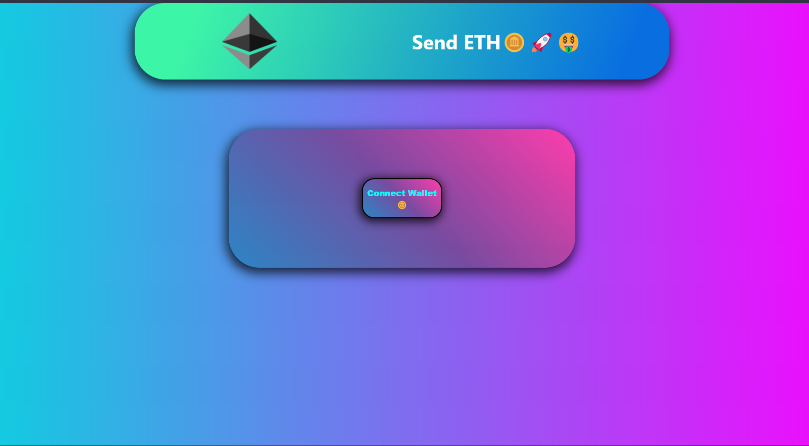
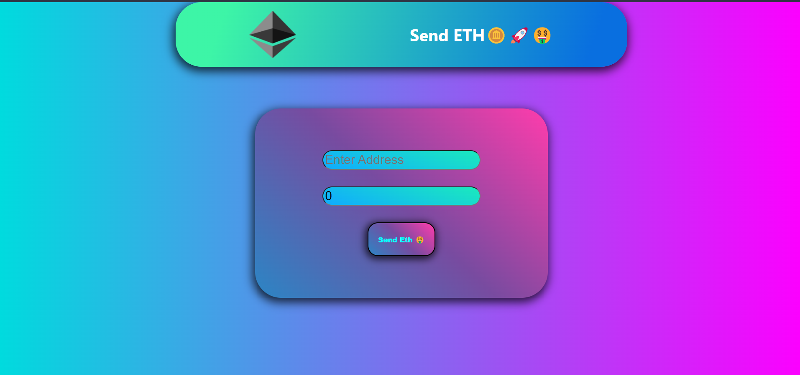

<!-- ABOUT THE PROJECT -->

# SendETH Project
This is a Ethereum Transaction project. You can send Ether to any Address, and you can choose the amount you want to send.

<p align="center">
  
</p>

### Build with
* [Solidity](https://docs.soliditylang.org/)
* [Hardhat](https://hardhat.org/getting-started/)
* [React.js](https://reactjs.org/)
* [ethers.js](https://docs.ethers.io/v5/)

<!-- PROJECT STRUCTURE -->

## Project Structure

### Connect Wallet Page

In this page, you can connect your wallet with your metamask ID. Make sure choose that address which has some ether to it. And then the new card will pop-up by which you can send ether.

### Send Transaction Page

<p align="center">
  
</p>

Now you are into the send transaction page, from where you can send ethers to another account. You have to paste the address of the account you want to send ether into the input field and put the amount you want to send.Then click to Send ETH button to send the transaction. As soon as you hit send, the metamask window will pop-up, from there you can confirm your transaction.

<!-- USER GUIDE -->

## How To Run

### Prerequisites

Please install or have installed the following:
* [nodejs](https://nodejs.org/en/download/) and [npm](https://www.npmjs.com/)
* [MetaMask](https://chrome.google.com/webstore/detail/metamask/nkbihfbeogaeaoehlefnkodbefgpgknn) Chrome extension installed in your browser
* [Hardhat](https://hardhat.org/getting-started/) For scripts and tests

After going through all the installation and setup steps, you'll need to download all the dependencies by running: 
  ```sh
   cd SendETH
   npm install
   ```
   This download all the needed dependencies. Then run following : 

   ```sh
   cd SendETH
   npx hardhat run --network localhost .\scripts\deploy.js
   ```
  This will create an artifacts folder into the src folder inside frontend. You have to download all the dependencies inside frontend.

  ```sh
   cd frontend
   npm install
   ```
  To run the frontend
  ```sh
   cd frontend
   npm start
   ```
  Go back to SendETH folder and run following
  ```sh
   cd ..
   npx hardhat node
   ```

## Contributing
Feel free to contribute by sending a PR. 


